# **Chapter 2** - Preparation of Lab Environment 

<!--# **Chapter 2** - Preparation of Lab Environment-->

## 2.1 Instance Preparation

<blockquote style = "background-color: #e5f5e0 ; margin: 0 ; font-family: calibri;border: 2px solid #00441b; border-left: 6px solid #00441b; padding : 0.5em; border-radius: 8px; background-style:discrete" >
     <b> Note: </b>
Operating System: Certifier Framework is designed to run in Linux environments. This is primarily because:

- System calls and dependencies: It relies on Linux-specific system interfaces and libraries (like libssl, libprotobuf, etc.).

- Build tools and scripts: The setup uses build tools like make, cmake, and dependencies typically installed via apt, which are native to Debian/Ubuntu or similar Linux distributions.

- Enclave Support: If you're working with Intel SGX enclaves, they require Linux for most development environments and SDK/tooling.  </blockquote>

* Go to AWS and Sign In. Start by visiting AWS Management Console in your web browser. If you already have an AWS account, sign in with your credentials.

* Selecting the AWS Region in the console home:

In the top-right corner of the AWS Management Console, click on the current region (e.g., "US-East-1"). A dropdown menu will appear listing various AWS regions. Select the preferred region for your EC2 instance - "N.Virginia".

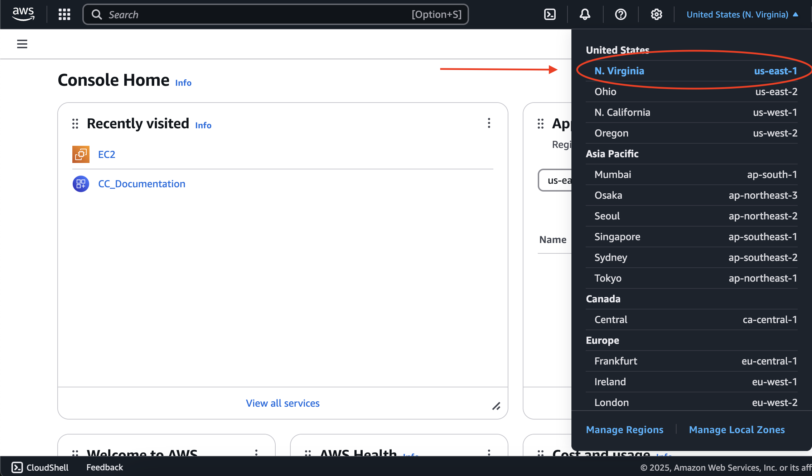

* Navigating to the AWS EC2 Service:

In the search bar at the top, type "EC2". Click on the "EC2 - Virtual Servers in the Cloud" option from the dropdown menu to open the EC2 dashboard.

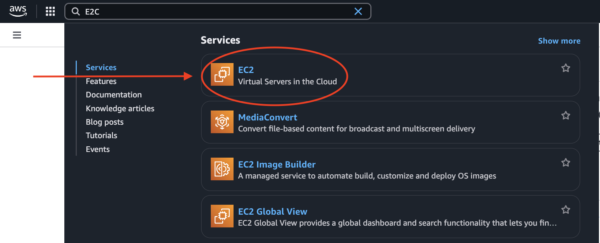

* As a result to clicking E2C, it will take to this page where you willl select "AMIs" in the left side of the page to create your AWS Instance

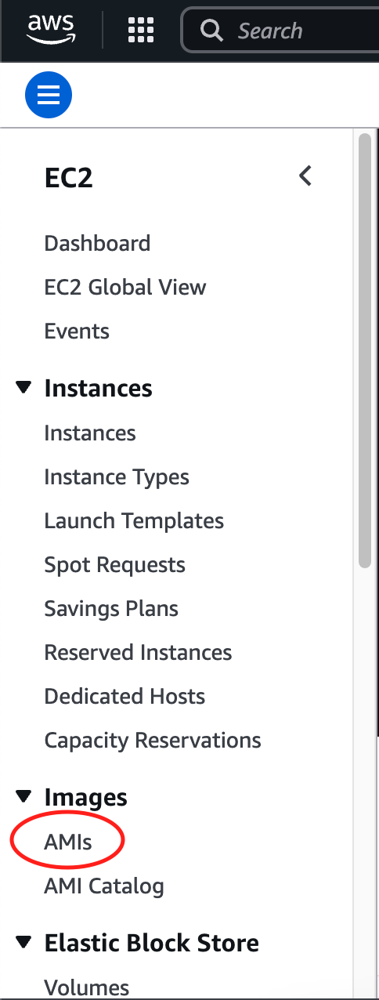

* Search AMIs, type: "certifier_fw_image" and select the AMI. Click "Launch instance from AMI" in the top right corner. Make sure to check the filter that it is "Public Images". It might take a minute to load. 

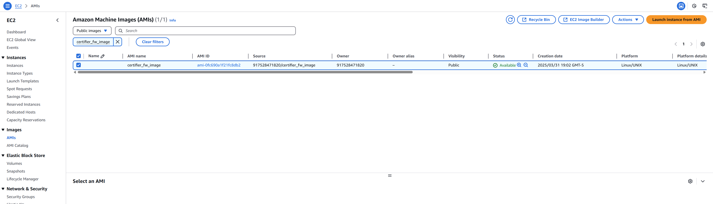

## 2.2 Launch an Instance
Create your virtual instance 

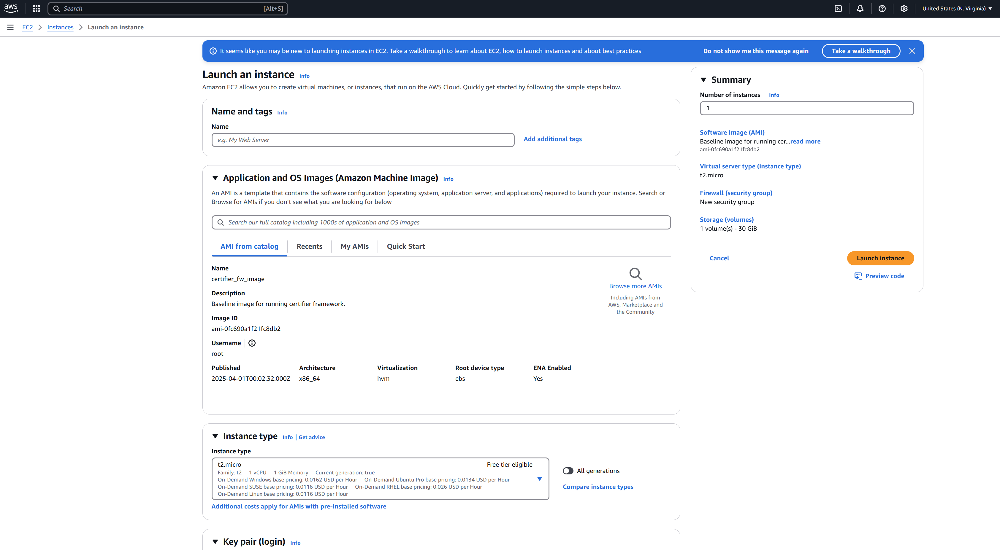

* Enter a unique name for your virtual machine (EC2 instance) under the "Name and tags" section.
* This name helps you identify your instance among multiple instances in your AWS environment.
* Example: In the image, the instance is named "sample_instance".

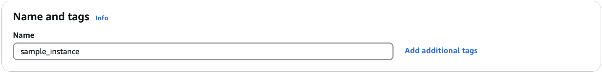

* Make sure the Application and OS image is already configured to the selected AMI's settings.

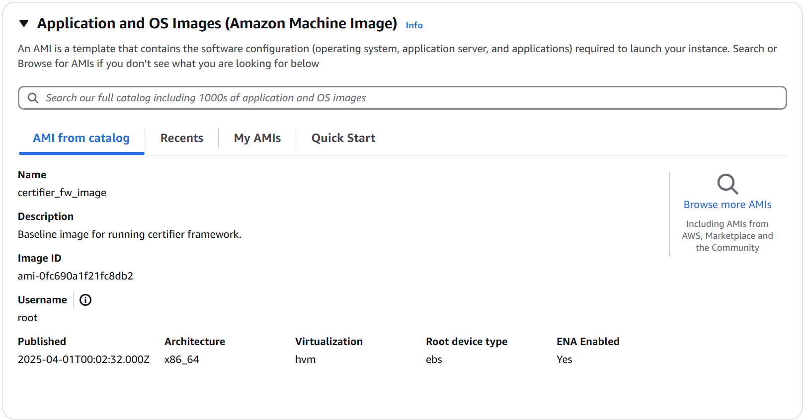

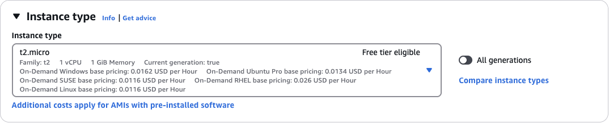

* Create new Key Pair (login) 

* Name your Key & create

<blockquote style = "background-color: #e5f5e0 ; margin: 0 ; font-family: calibri;border: 2px solid #00441b; border-left: 6px solid #00441b; padding : 0.5em; border-radius: 8px; background-style:discrete" >
     <b> Note: </b>
The created key pair will be downloaded locally.  </blockquote>

* Make sure your Network settings and your storage configurations remain the same with no changes required. The existing configurations are from your selected AMI.

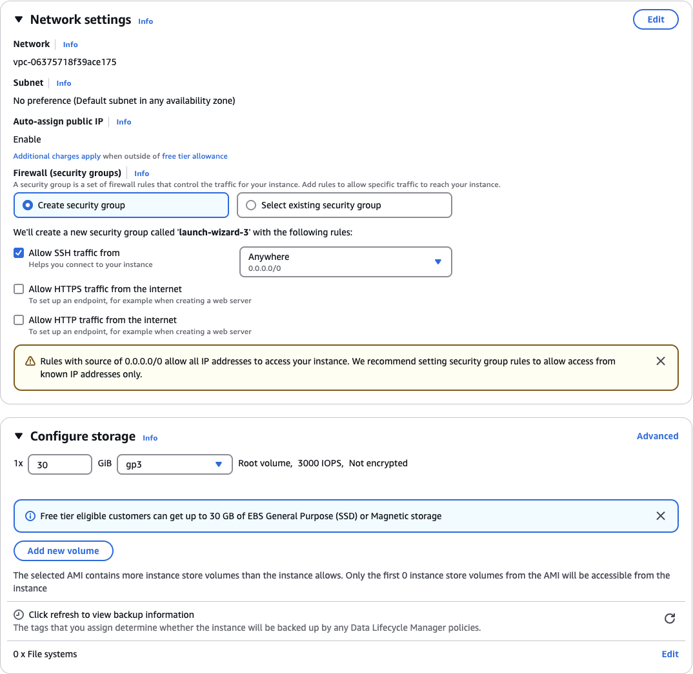

* On the left side of the portal, you can view your instance summary. ***Launch Instance***

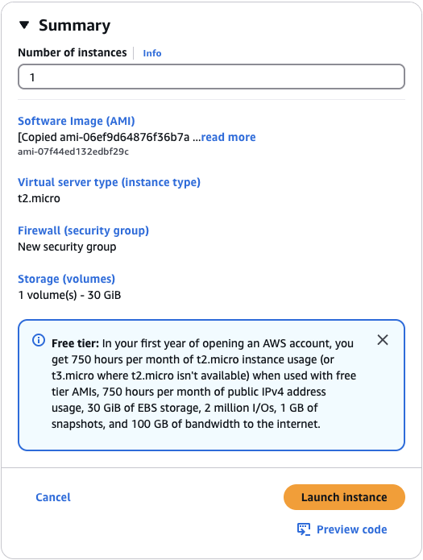

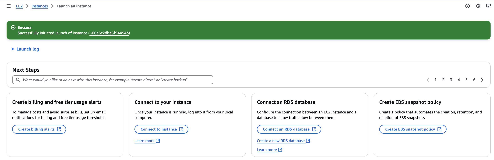

* Below, choose the option: "connect to your instance"

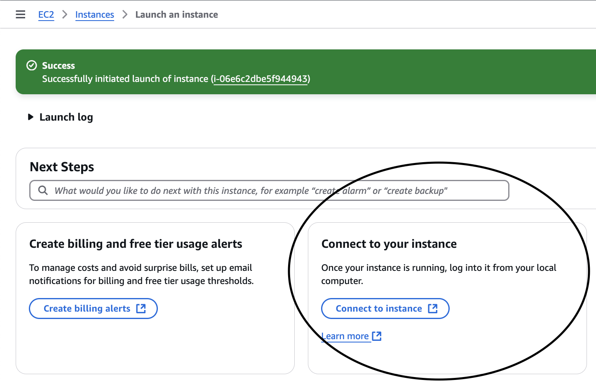

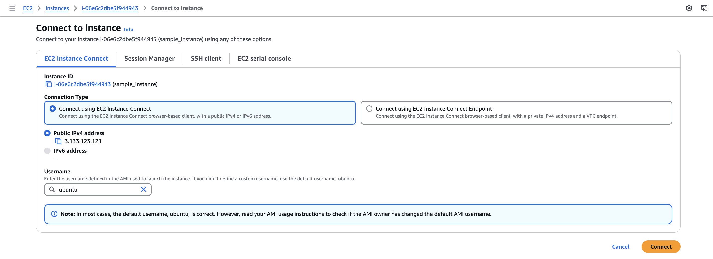

***Your AWS instance***

You might face a connection issue (NAT issue), reload your tab or relaunch your created instance. You will end up in this view as shown in the figure below.

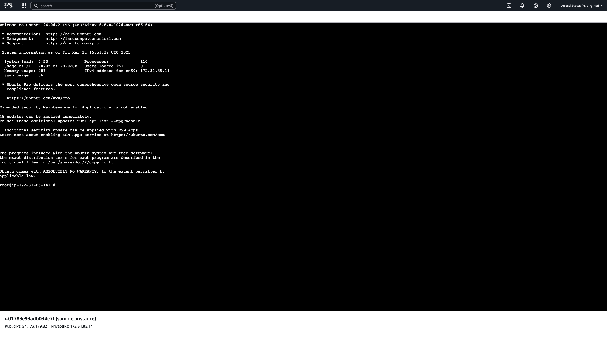

