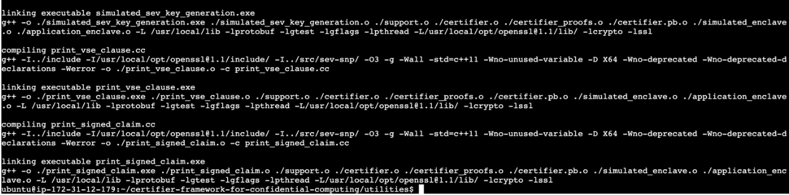
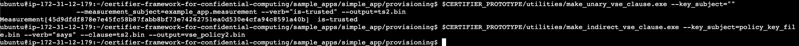
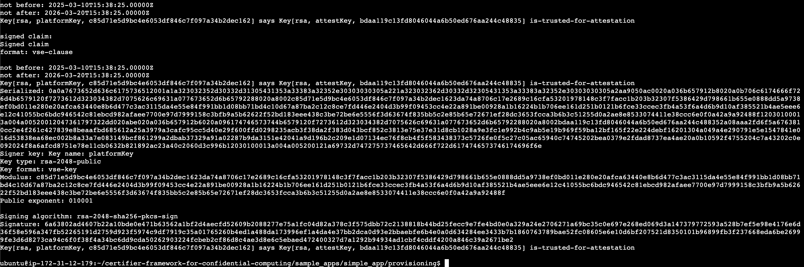
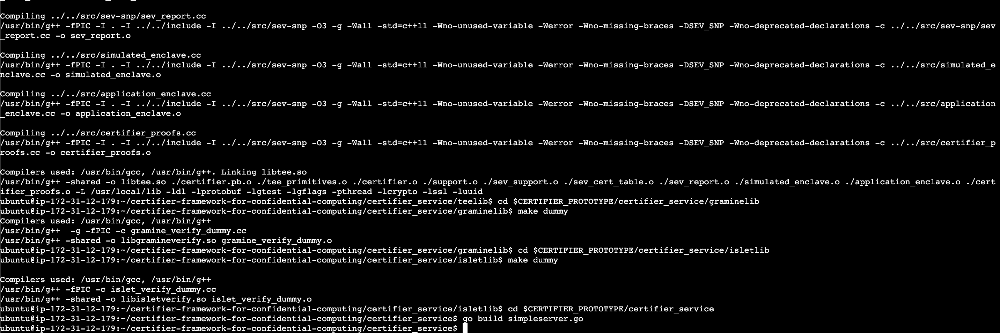
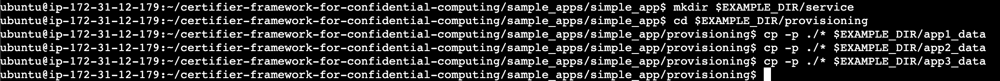
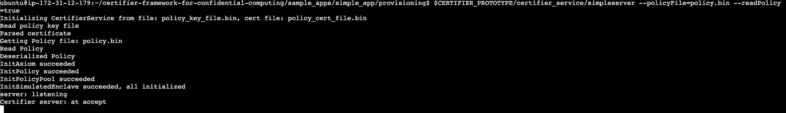

# **Chapter 3** - Getting Started with Building & Running Certifier Framework

**(I) Install the pre-requisites:**
This step ensures your system has all the necessary base packages (like git, curl, etc.) by updating the package list using apt-get.

```bash
    $ sudo apt-get update
```

**(II) Clone the Repository:** 
Here, the Certifier Framework source code is cloned from GitHub. This also includes installing necessary Go protobuf tools for building the project.

```bash
    $ git clone https://github.com/ccc-certifier-framework/certifier-framework-for-confidential-computing.git
    $ cd certifier-framework-for-confidential-computing
```
<center>
<a name = "fig2.1"></a></center>

**(III) Install Dependencies:** 
This step sets up important environment variables such as the project path and application paths, and ensures Go binaries are available in your shell.
   
```bash
    $ export CERTIFIER_PROTOTYPE=/root/certifier-framework-for-confidential-computing
    $ export EXAMPLE_DIR=$CERTIFIER_PROTOTYPE/sample_apps/simple_app
    $ export PATH=$PATH:/local/go/bin
    $ export PATH=$PATH:$(go env GOPATH)/bin
```

**(IV) Remove Non-Git Files:**
Runs a utility script to clean up any non-versioned files from the sample application directory to ensure a clean build/run environment.

```bash
    $ cd sample_apps  
    $ ./run_example.sh simple_app rm_non_git_files
```
<center>
<a name = "fig2.1"></a></center>

**(V) Building Utilities:**
This step compiles utility executables like cert_utility and policy_utilities used later for certificate and policy key generation.

```bash
$ cd $CERTIFIER_PROTOTYPE/utilities
$ make -f cert_utility.mak
$ make -f policy_utilities.mak
```
<center>
<a name = "fig2.1"></a></center>

**(VI) Generate Policy Key and Self Signed Certificate:**
This generates a new policy key and a self-signed certificate that will be used to verify trust policies during enclave app execution.

```bash
$ mkdir $EXAMPLE_DIR/provisioning
$ cd $EXAMPLE_DIR/provisioning
$ $CERTIFIER_PROTOTYPE/utilities/cert_utility.exe --operation=generate-policy-key-and-test-keys --policy_key_output_file=policy_key_file.bin  --policy_cert_output_file=policy_cert_file.bin --platform_key_output_file=platform_key_file.bin --attest_key_output_file=attest_key_file.bin
```

<center>
<a name = "fig2.1"></a></center>


**(VII) Embedded Policy Key:**
Takes the previously generated certificate and embeds it into a binary file (policy_cert_file.bin) that the example app will use.

```bash
$ cd $EXAMPLE_DIR/provisioning
$ $CERTIFIER_PROTOTYPE/utilities/embed_policy_key.exe --input=policy_cert_file.bin                   --output=../policy_key.cc
```
<center>
<a name = "fig2.1"></a></center>

**(VIII) Compile example_app with the embedded policy_key:**
This final step compiles the example_app using the embedded policy key, completing the setup of the trusted application.

```bash
$ cd $EXAMPLE_DIR
$ make -f example_app.mak
```
<center>
<a name = "fig2.1"></a></center>


**(IX) Obtain the measurement of the trusted application for this security domain:**
This step creates a cryptographic hash (measurement) of the trusted enclave binary. This hash will be used later to verify the application’s integrity.

```bash
$ cd $EXAMPLE_DIR/provisioning
$ $CERTIFIER_PROTOTYPE/utilities/measurement_utility.exe --type=hash --input=../example_app.exe --output=example_app.measurement
```

**(X) Construct PolicyKey says PlatformKey is-trusted-for-attestation:**
This builds a logical policy statement where the policy key asserts that the platform key is trusted to perform attestation.

```bash
$ $CERTIFIER_PROTOTYPE/utilities/make_unary_vse_clause.exe --key_subject=platform_key_file.bin --verb="is-trusted-for-attestation" --output=ts1.bin
$ $CERTIFIER_PROTOTYPE/utilities/make_indirect_vse_clause.exe --key_subject=policy_key_file.bin --verb="says" --clause=ts1.bin --output=vse_policy1.bin
```

<center>
<a name = "fig2.1"></a></center>

**(XI) Construct PolicyKey says measurement is-trusted:**
This creates a second policy clause asserting the trusted status of the measured application binary.

```bash
$ $CERTIFIER_PROTOTYPE/utilities/make_unary_vse_clause.exe --key_subject=""                                  --measurement_subject=example_app.measurement --verb="is-trusted" --output=ts2.bin
$ $CERTIFIER_PROTOTYPE/utilities/make_indirect_vse_clause.exe --key_subject=policy_key_file.bin --verb="says" --clause=ts2.bin --output=vse_policy2.bin
```

<center>
<a name = "fig2.1"></a></center>

**(XII) Produce Signed Claims for each vse policy statements:**
Each policy statement (from Steps X and XI) is signed by the policy key to produce cryptographic claims certifying the statements.

```bash
$ $CERTIFIER_PROTOTYPE/utilities/make_signed_claim_from_vse_clause.exe --vse_file=vse_policy1.bin --duration=9000 --private_key_file=policy_key_file.bin --output=signed_claim_1.bin
$ $CERTIFIER_PROTOTYPE/utilities/make_signed_claim_from_vse_clause.exe --vse_file=vse_policy2.bin --duration=9000 --private_key_file=policy_key_file.bin                          --output=signed_claim_2.bin
```

<center>
<a name = "fig2.1"></a></center>

**(XIII) Combine Signed Policy Statements for Certifier Service Use:**
Both signed claims are packaged into a single file for easy access and verification by the Certifier Service.

```bash
$ $CERTIFIER_PROTOTYPE/utilities/package_claims.exe --input=signed_claim_1.bin,signed_claim_2.bin --output=policy.bin
```

**(XIV) Construct statement “platform-key says attestation-key is-trusted-for-attestation" ans sign it:**
This step builds a trust delegation clause where the platform key delegates trust to the attestation key for attestation tasks.

```bash
$ $CERTIFIER_PROTOTYPE/utilities/make_unary_vse_clause.exe --key_subject=attest_key_file.bin --verb="is-trusted-for-attestation" --output=tsc1.bin
$ $CERTIFIER_PROTOTYPE/utilities/make_indirect_vse_clause.exe --key_subject=platform_key_file.bin --verb="says" --clause=tsc1.bin --output=vse_policy3.bin
$ $CERTIFIER_PROTOTYPE/utilities/make_signed_claim_from_vse_clause.exe --vse_file=vse_policy3.bin --duration=9000 --private_key_file=platform_key_file.bin --output=platform_attest_endorsement.bin
```

<center>
<a name = "fig2.1"></a></center>

**(XV) Build Simpleserver:** 
This step compiles the core Certifier services needed to run the trust management and attestation server. It includes compiling protobuf definitions and building various Certifier service libraries (oelib, teelib, graminelib, isletlib) before building the final simpleserver.go.

```bash
$ cd $CERTIFIER_PROTOTYPE/certifier_service/certprotos
$ protoc --go_opt=paths=source_relative --go_out=. --go_opt=M=certifier.proto ./certifier.proto
$ cd $CERTIFIER_PROTOTYPE/certifier_service/oelib
$ make dummy
$ cd $CERTIFIER_PROTOTYPE/certifier_service/teelib
$ make 
$ cd $CERTIFIER_PROTOTYPE/certifier_service/graminelib
$ make dummy
$ cd $CERTIFIER_PROTOTYPE/certifier_service/isletlib
$ make dummy
$ cd $CERTIFIER_PROTOTYPE/certifier_service
$ go build simpleserver.go
```
<center>
<a name = "fig2.1"></a></center>

**(XVI) Create directories for app data:** 
Creates separate directories (app1_data, app2_data, app3_data) to organize application-specific security data like measurements, claims, and policy keys.

```bash
$ cd $EXAMPLE_DIR 
$ mkdir app1_data app2_data 
```
<center>
<a name = "fig2.1"></a></center>

**(XVII) Create a directory for service data:**
Creates a directory to store shared service-related data, needed for the certifier service to operate and manage trusted components.

```bash
$ mkdir $EXAMPLE_DIR/service 
```

**(XVIII) Provision the app files:**
Copies the provisioned files such as measurements, keys, and claims into the respective app directories (app1_data, app2_data) to prepare them for use with the certifier service.

```bash
$ cd $EXAMPLE_DIR/provisioning 
$ cp -p ./* $EXAMPLE_DIR/app1_data 
$ cp -p ./* $EXAMPLE_DIR/app2_data 
```

<center>
<a name = "fig2.1"></a></center>

**(XIX) Provision the service files and start the certifier service:**
In this final setup step, the Certifier Service is launched using the provisioned policy files. It reads the policy key, certificate, and policy statements, initializes internal components, and begins listening for incoming connections.

```bash
$ cd $EXAMPLE_DIR/provisioning
$ cp -p policy_key_file.bin policy_cert_file.bin policy.bin $EXAMPLE_DIR/service
```

**(XX) Start the Certifier Service:**

```bash
$ cd $EXAMPLE_DIR/service 
$ $CERTIFIER_PROTOTYPE/certifier_service/simpleserver --policyFile=policy.bin --readPolicy=true
```
<center>
<a name = "fig2.1"></a></center>

**_What happens here:_**

* The server loads the policy key and certificate.

* It deserializes and validates the policy statements.

* Initializes trust evaluation mechanisms and simulated enclave setup.

* Starts the server to listen for attestation and trust evaluation requests.

Once you see Certifier server: **at accept**, it means the service is up and running!


## 2.3 As a Result
By now, the Certifier Framework is set up and running successfully in the VM. You prepared the environment by installing necessary dependencies, cloning the framework repository, and compiling its core components, including utilities and the Certifier Service. You then provisioned the framework by generating cryptographic keys, creating trust policies, and embedding a policy key into the example application.  

Following this, you authored and signed trust policies, combining them into a single policy file (policy.bin) to define the framework's trust relationships. Finally, you started the Certifier Service (simpleserver), which is now operational and ready to enforce policies and evaluate trust for connected applications. At this point, the Certifier Framework is fully functional and prepared for use in trusted communication scenarios. 
