<a name = "Pg3"></a>

# **Chapter 4** - Build/Run Client-Server Connection 

# 4.1 Securely Communicating within a Trusted Execution Environment (TEE)

The commands provided outline the setup and execution of a trusted application that operates in a client-server model with multiple clients. The process ensures that all participants (server and clients) are initialized, certified, and securely communicating within a trusted execution environment (TEE). 


**Process Breakdown:**

(I) **Initialization** (cold-init) 

- Each client and the server must be initialized separately with a designated data directory (app1_data/, app2_data/). 

- This sets up the environment and prepares for secure operations. 

(II) **Certification** (get-certified) 

- After initialization, each instance (server and client) undergoes a certification process. 

- This verifies that the system adheres to predefined security and integrity policies. 

(III) **Running the Server and Clients**

- The server is started first using run-app-as-server, making it available for client communication. 

- The client is then started (run-app-as-client), allowing them to interact with the trusted server. 


**Purpose** 

* Ensures secure execution of the application. 

* Guarantees that all components (server and client) meet security policies before communication. 

* Demonstrates a trusted service environment where only certified entities can interact. 

This process ensures a secure, integrity-verified, and policy-compliant client-server architecture in a trusted execution setting. 


# 4.2 Opening a New Instance Tab

This step is to show the way to create another same instance tab within the created instance so that there is instances for: 
- Running App as server
- Running App as client

Go back to the AWS tab where you connect to the instance after you created it and click "connect" again to open same new instance. 

<center>
<a name = "fig2.1"></a>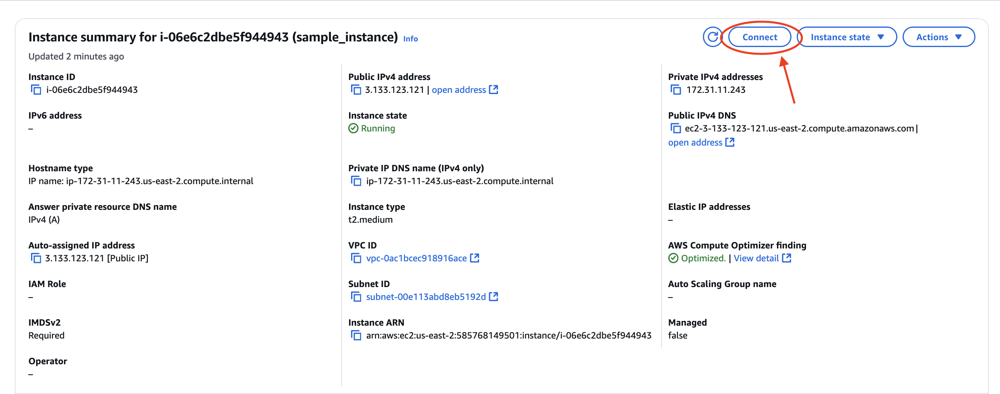</center>

<center>
<a name = "fig2.1"></a></center>

<center>
<a name = "fig2.1"></a>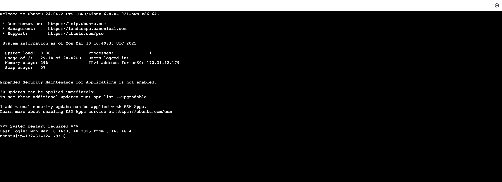</center>

# 4.3 Run Commands
After provisioning is done and the Certifier service is running, these commands help run the actual trusted application in client and server modes.

**(I) On a new instance tab:** 
Re-export the necessary environment variables to make sure the paths and directories are correctly set in the new terminal session.

```bash
$ export CERTIFIER_PROTOTYPE=/root/certifier-framework-for-confidential-computing
$ export EXAMPLE_DIR=$CERTIFIER_PROTOTYPE/sample_apps/simple_app 
$ export PATH=$PATH:/local/go/bin 
$ export PATH=$PATH:$(go env GOPATH)/bin 
```
<center>
<a name = "fig2.1"></a>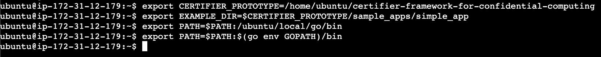</center>

**(II) For Running App as Client:**
The client performs a cold initialization and then requests a certificate from the Certifier service.

```bash
$ cd $EXAMPLE_DIR 
$ $EXAMPLE_DIR/example_app.exe --data_dir=./app1_data/ --operation=cold-init --measurement_file="example_app.measurement" --policy_store_file=policy_store --print_all=true 

$ $EXAMPLE_DIR/example_app.exe --data_dir=./app1_data/ --operation=cold-init --measurement_file="example_app.measurement" --policy_store_file=policy_store --print_all=true

$ $EXAMPLE_DIR/example_app.exe --data_dir=./app1_data/ --operation=get-certified                    --measurement_file="example_app.measurement" --policy_store_file=policy_store --print_all=true
```
<center>
<a name = "fig2.1"></a>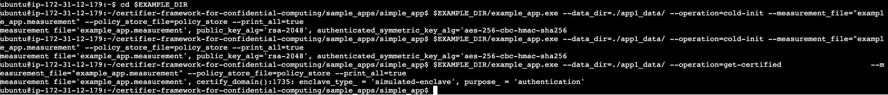</center>

- **If you look back at your certifier service instance tab, this is what it will look like:** _You’ll see logs showing the attestation request, proof verification, and certificate receipt both in the client terminal and in the Certifier service terminal._

<center>
<a name = "fig2.1"></a>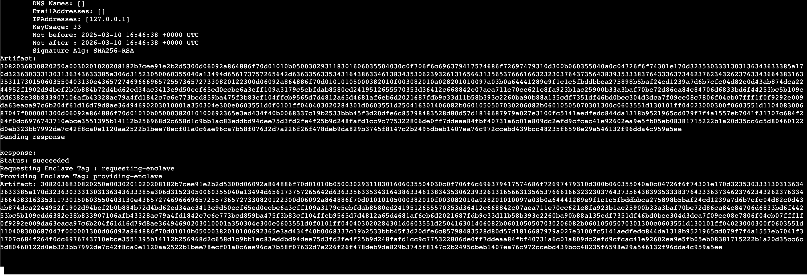</center>

**- Once the app_data for client 1 is set up, open a new terminal again and run commands:**
Once app1_data is set up and certified, you can open another terminal tab and run the app in server mode.


**(III) Again, create a new instance tab for running app as Server:**

<center>
<a name = "fig2.1"></a></center>

<center>
<a name = "fig2.1"></a></center>

<center>
<a name = "fig2.1"></a></center>

```bash
$ export CERTIFIER_PROTOTYPE=/root/certifier-framework-for-confidential-computing 
$ export EXAMPLE_DIR=$CERTIFIER_PROTOTYPE/sample_apps/simple_app 
$ export PATH=$PATH:/local/go/bin 
$ export PATH=$PATH:$(go env GOPATH)/bin 
```
<center>
<a name = "fig2.1"></a></center>
Re-export the necessary environment variables to make sure the paths and directories are correctly set in the new terminal session.

**(IV) For Running App as Server:** 

```bash
$ cd $EXAMPLE_DIR 
$ $EXAMPLE_DIR/example_app.exe --data_dir=./app2_data/ --operation=cold-init --measurement_file="example_app.measurement" --policy_store_file=policy_store --print_all=true 

$ $EXAMPLE_DIR/example_app.exe --data_dir=./app2_data/ --operation=get-certified                 --measurement_file="example_app.measurement" --policy_store_file=policy_store --print_all=true 
```

<center>
<a name = "fig2.1"></a>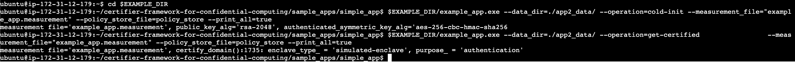</center>

Again, if you look back to your famework tab, you can see as shown below:

<center>
<a name = "fig2.1"></a>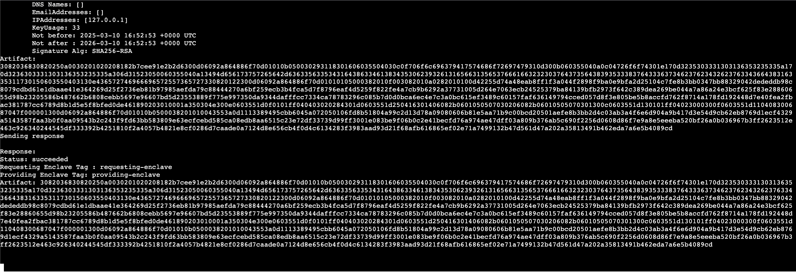</center>

- **If you look back at your certifier service instance tab, this is what it will look like:** _You’ll see logs showing the attestation request, proof verification, and certificate receipt both in the client terminal and in the Certifier service terminal._


**(V) In the server terminal: In the app-as-a-server terminal run the following:** 

```bash
$ cd $EXAMPLE_DIR 
$ $EXAMPLE_DIR/example_app.exe --data_dir=./app2_data/ --operation=run-app-as-server   --policy_store_file=policy_store --print_all=true 
```

<center>
<a name = "fig2.1"></a>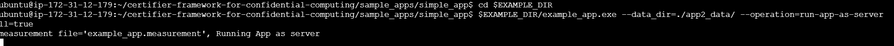</center>

**(VI) Navigate back to the Client 1 terminal:** In the app-as-a-client1 terminal, run the following:

```bash
$ cd $EXAMPLE_DIR 
$ $EXAMPLE_DIR/example_app.exe --data_dir=./app1_data/ --operation=run-app-as-client --policy_store_file=policy_store --print_all=true 
```
<center>
<a name = "fig2.1"></a>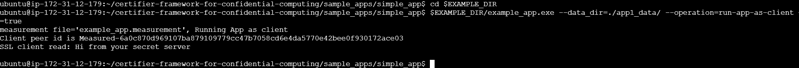</center>


## 4.3 As a Result

Now, communication between the client and server has been established. The client-server connection in this setup operates within a trusted execution environment (TEE), ensuring that only certified and integrity-verified entities can communicate securely. 

In your server terminal, it will look like this: 
<center>
<a name = "fig2.1"></a>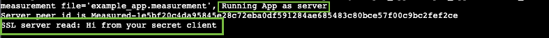</center>

In your client terminal, it will look like this: 
<center>
<a name = "fig2.1"></a>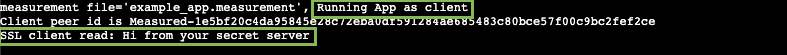</center>


By following a structured process of initialization, certification, and execution, both the server and clients establish a mutually trusted relationship where data integrity and security policies are strictly enforced. The server acts as a central trusted entity, while the clients securely connect and interact with it, ensuring a confidential, authenticated, and tamper-resistant communication flow. This architecture is essential for secure distributed computing, confidential computing applications, and environments where trust and integrity are critical. 

The Certifier Framework provides a robust and structured approach to establishing trust in confidential computing environments. Through its core components—the Certifier API and Certifier Service—it enables secure application deployment by enforcing cryptographic policies, attesting platform integrity, and ensuring compliance across distributed systems. 

By following this guide, you have successfully set up the framework, provisioned secure applications, and established trusted client-server communication within a secure execution environment. The hands-on implementation highlights the importance of cryptographic validation, policy-driven trust management, and seamless integration across various computing platforms. 

As organizations increasingly adopt confidential computing to safeguard sensitive data, the Certifier Framework plays a crucial role in standardizing security practices, mitigating risks, and enhancing trust in cloud and multi-cloud infrastructures. By leveraging this framework, developers and security practitioners can confidently build and deploy applications that uphold the highest standards of confidentiality, integrity, and authenticity in today’s evolving digital landscape. 


